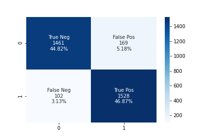
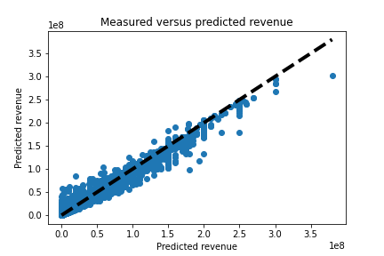

# Movie Release Predictor 📽🍿🎬


Isaac Rodriguez

Data Part-Time, Barcelona, Dec 19


# Welcome

This repository contains my final project for Ironhack. I am predicting if a new release (movie) is going to succeed or not and how much the revenue is going to be.

# Approach

Our main structure follows these key subjects:

- Data Engineering (Building the dataset)
- Data Analytics (Correlations, getting insights, discover not obvious patterns)
- Machine Learning (Train and predict)

# Folder structure

```
  .
  ├── notebooks                                 # (Contains all notebooks to run the project)
  │   ├── 1.Dataset_Builder.ipynb               # Runs and builds the dataset
  │   ├── 2.1.Pre_transformation.ipynb          # Pre-transforms the dataset. JSON -> Array     
  │   ├── 2.2.People_Pre_Transformation.ipynb   # Creates People dataset, by id and year.
  │   ├── 3.EDA.ipynb                           # Visualize and get insights from dataset.
  │   ├── 4.Data_Wrangling.ipynb                # Feature Selection and Feature Engineering
  │   ├── 5.1.Model_Classification.ipynb        # Supervised Learning - Classification
  │   └── 5.2.Model_Regression.ipynb            # Supervised Learning - Regression
  ├── source                      # (Contains all python scripts)      
  │   ├── config.py               # Contains the TMDB API Key
  │   ├── constants.py            # Constants  
  │   ├── helpers.py              # Contains helpers scripts as visualizing confusion matrix, encoding...  
  │   ├── tmdb_retriever.py       # Script to retrieve tmdb id from imdb one.  
  │   ├── tmdb_movies.py          # Script to retrieve all movies from a tmdb id.
  │   └── tmdb_people.py          # Script to retrieve all people from a tmdb id.
  └── data
      ├── pre-processed             # (Contains all pre-processed csv)
      │   └── title_basics.tsv      # IMDB Interface
      ├── exports                   # Plots visualization
      └── processed                 # (Contains all processed csv)
          ├── json                  # All outputs from our scripts
          ├── dataset_builder       # Final dataset csv
          ├── modeling              # CSV used for modeling
          ├── people_transformation # CSV used for people transformation
          └── transformation        # CSV used for transformation  
```

# Pre-conditions

- To successfully run our python scripts, you should get a [TMDB API KEY](https://www.themoviedb.org/documentation/api) and then put it over `../source/config.py`.
- You should be aware that running the project from scratch (including getting the dataset) takes between 4 - 5 hours. In case you only want to run the models, contact me and I will provide you the dataset (as it's too big to be included here).
- Tests runs automatically when you push to master.

# Problems to solve

- Is a new movie release going to succeed? We assume movie success when the vote average is superior to 8.0.
- How much will the movie revenue going to be?

# Dataset

We did not discover any dataset which satisfies our standards, so I decided to code my own. Here is the plan:

- Get an interface of Imdb dataset: http://www.imdb.com/interfaces
- Use https://www.themoviedb.org/documentation/api to build the final dataset.

# Cleaning

We can split our cleaning between two tasks. `Movies` and `people`.

**Movies**: Our movies dataset contained JSON values which needed to be transformed to array. We did this transformation on `genres`, `production_companies`, `production_countries`, `spoken_languages`, `cast` and `crew`.

**People**: Our people dataset was modeled to visualize the movie mean each cast member made (value) by year (column). We transformed, melt, grouped by and pivoted our initial dataset to get our desired one.

# Analysis

When we analyzed our data we wanted to make sure our budget was up to date from an inflation point of view. $1 in 1980 is $3.11 now. Also removed NaNs, maintained the distribution for `runtime`, convert from `object` to the correct dtype (boolean, numeric). We also needed to downsampling our target as it was unbalanced.

# Model Training and Evaluation

Within our supervised system, we got two different types of algorithms. Classification and Regression.

**Classification**:

We trained our dataset with the following models:

- LogisticRegression - **F1 Score**: 0.650874, **FP**: 41.41%.
- KNeighborsClassifier - **F1 Score**: 0.758956, **FP**: 11.26%.
- DecisionTreeClassifier - **F1 Score**: 0.870510, **FP**: 7.33%.
- RandomForestClassifier - **F1 Score**: 0.905161, **FP**: 5.18%.

Before evaluating our model, we wanted to select the one with lowest number of False Positives. Imagine if a company invests on a movie which turns out it's not a success. Waste of money!

The one with lowest FP was **RandomForestClassifier**



**Regression**:

We trained our dataset with the following models:

- LinearRegression - **r_score**: -12400859334.004255 **STD**: 24801718668.740448
- ElasticNet - **r_score**: 0.20625525190172347 **STD**: 0.005989057171014842
- Lasso - **r_score**: 0.3573887852814629 **STD**: 0.017616671741721147
- RandomForestRegressor - **r_score**: 0.7618700212042965 **STD**: 0.015703154064752797
- XGBRegressor - **r_score**: 0.7028048702955509 **STD**: 0.011856939771628215

Before evaluating our model we wanted to select the one with higher r2_score and lowest STD value.

**r2_score**: This number indicates the percentage of the variance in the dependent variable that the independent variables explain collectively. Highest this number the best!
**STD**: Standard deviation is a measure of the amount of variation or dispersion of a set of values. Lowest this number the best!

The one with these metrics was **RandomForestRegressor**!



# Visualize our Model

We used our model to predict if `Avatar 2` is going to succeed and how much is going to make.

To put in context, let's create a table to visualize differences between `Avatar` and what we predict for `Avatar 2`

<table>
    <thead>
      <tr>
        <th>Title</th>
        <th>Success</th>
        <th>Revenue</th>
      </tr>
    </thead>
    <tbody>
        <tr>
            <td>Avatar</td>
            <td>False (7.4)</td>
            <td><code>$2,790,439,000</code></td>
        </tr>
        <tr>
            <td>Avatar 2</td>
            <td>False</td>
            <td><code>$215.992.000</code></td>
        </tr>
    </tbody>
  </table>

# Next steps

- Add more metadata to each release. As producers, companies...
- Tune our models with better hyperparameters.
- PCA to remove clearly uncorrelated features.

# Conclusion

- We got a good score from the selected models. It’s utopic to relay on metadata only to predict the success of a movie though. We should create a model that avoids black swans and long-tail distribution scenarios!
- Predicting `Avatar 2` turned out the revenue between movies is going to be reduced by 10x. As Avatar was an outlier, we should wait until it is released to determine if our model should be more prepared for this kind of event.

# Links

[Slides](https://drive.google.com/file/d/1x8zbtqVa8g73yLTOwFXDrr5NSRB9bXQ2/view)  
